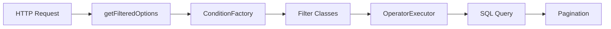

# CustomQueryBuilder - Документация фильтрации 🔍

> Кастомный построитель запросов для Laravel с расширенными возможностями фильтрации, сортировки и пагинации через
> параметры запроса.

---

## 📑 Содержание

- [Базовые параметры](#-базовые-параметры)
- [Методы запросов (GET/POST)](#-методы-запросов-getpost)
- [Фильтры WHERE](#-фильтры-where)
- [Операторы сравнения](#-операторы-сравнения)
- [BETWEEN фильтры](#-between-фильтры)
- [Фильтры связей](#-фильтры-связей)
- [Поисковый фильтр](#-поисковый-фильтр)
- [Сортировка](#-сортировка)
- [Пагинация](#-пагинация)
- [Комплексные примеры](#-комплексные-примеры)
- [Advanced Filter](#-advanced-filter-устаревший)
- [Алиасы параметров](#-алиасы-параметров)
- [Архитектура](#-архитектура)
- [Примечания](#-примечания)

---

## ⚙️ Базовые параметры

### `fields` - Выбор полей

```http
GET /api/products?fields[]=id&fields[]=name&fields[]=price
```

### `page` - Номер страницы

```http
GET /api/products?page=2
```

### `itemsPerPage` - Количество элементов на странице

```http
GET /api/products?itemsPerPage=50
```

---

## 🌐 Методы запросов (GET/POST)

Фильтры работают **одинаково** как с GET параметрами, так и с POST JSON запросами!

### GET запрос с query параметрами

```http
GET /api/products?where[status]=active&where[price][operator]=>&where[price][value]=100
```

### POST запрос с JSON телом

```http
POST /api/products
Content-Type: application/json
```

```json
{
    "where": {
        "status": "active",
        "price": {
            "operator": ">",
            "value": 100
        }
    },
    "whereBetween": {
        "created_at": {
            "from": "2024-01-01",
            "to": "2024-12-31"
        }
    },
    "whereHas": {
        "category": {
            "where": {
                "name": "Electronics"
            }
        }
    },
    "sortBy": [
        {
            "key": "price",
            "order": "asc"
        }
    ],
    "page": 1,
    "itemsPerPage": 20
}
```

### 💡 Преимущества POST с JSON

| Преимущество        | Описание                              |
|---------------------|---------------------------------------|
| ✅ Удобство          | Идеально для сложных фильтров         |
| ✅ Читабельность     | Чистая структура данных               |
| ✅ Вложенность       | Легко работать с вложенными объектами |
| ✅ Без ограничений   | Нет лимита на длину URL               |
| ✅ Frontend-friendly | Простая интеграция с frontend         |

---

## 🔎 Фильтры WHERE

### `where` - Базовая фильтрация

<details>
<summary><b>Простое равенство</b></summary>

**GET:**

```http
GET /api/products?where[status]=active
```

**POST JSON:**

```json
{
    "where": {
        "status": "active"
    }
}
```

</details>

<details>
<summary><b>С оператором IN (массив значений)</b></summary>

**GET:**

```http
GET /api/products?where[status][]=active&where[status][]=pending
```

**POST JSON:**

```json
{
    "where": {
        "status": [
            "active",
            "pending"
        ]
    }
}
```

</details>

<details>
<summary><b>С явным оператором</b></summary>

**GET:**

```http
GET /api/products?where[price][operator]=>&where[price][value]=100
```

**POST JSON:**

```json
{
    "where": {
        "price": {
            "operator": ">",
            "value": 100
        }
    }
}
```

</details>

### ➕ `orWhere` - Условие ИЛИ

**GET:**

```http
GET /api/products?orWhere[status]=active&orWhere[status]=pending
```

**POST JSON:**

```json
{
    "orWhere": {
        "status": [
            "active",
            "pending"
        ]
    }
}
```

### ⛔ `whereNot` - Исключение значений

**GET:**

```http
GET /api/products?whereNot[status]=deleted
```

**POST JSON:**

```json
{
    "whereNot": {
        "status": "deleted",
        "id": [
            5,
            10
        ]
    }
}
```

---

## 🔢 Операторы сравнения

### Доступные операторы

| Оператор   | Описание         | Пример                                                             |
|------------|------------------|--------------------------------------------------------------------|
| `=`        | Равно            | `where[status][operator]==&where[status][value]=active`            |
| `!=`       | Не равно         | `where[status][operator]=!=&where[status][value]=deleted`          |
| `>`        | Больше           | `where[price][operator]=>&where[price][value]=100`                 |
| `<`        | Меньше           | `where[price][operator]=<&where[price][value]=500`                 |
| `>=`       | Больше или равно | `where[stock][operator]=>=%where[stock][value]=10`                 |
| `<=`       | Меньше или равно | `where[discount][operator]=<=&where[discount][value]=50`           |
| `like`     | LIKE             | `where[name][operator]=like&where[name][value]=Phone%`             |
| `not like` | NOT LIKE         | `where[name][operator]=not like&where[name][value]=%test%`         |
| `%like%`   | LIKE с wildcards | `where[name][operator]=%like%&where[name][value]=phone`            |
| `like%`    | Начинается с     | `where[name][operator]=like%&where[name][value]=Apple`             |
| `%like`    | Заканчивается на | `where[name][operator]=%like&where[name][value]=Pro`               |
| `in`       | IN (список)      | `where[id][operator]=in&where[id][value][]=1&where[id][value][]=2` |
| `not in`   | NOT IN           | `where[status][operator]=not in&where[status][values][]=deleted`   |
| `is`       | IS NULL/NOT NULL | `where[deleted_at][operator]=is&where[deleted_at][value]=null`     |

### Примеры использования

<details>
<summary><b>GET запросы</b></summary>

```http
GET /api/products?where[price][operator]=>&where[price][value]=100
```

Цена больше 100

```http
GET /api/products?where[name][operator]=%like%&where[name][value]=phone
```

Название содержит "phone"

```http
GET /api/products?where[status][operator]=in&where[status][value][]=active&where[status][value][]=pending
```

Статус в списке значений

```http
GET /api/products?where[deleted_at][operator]=is&where[deleted_at][value]=null
```

Проверка на NULL

</details>

<details>
<summary><b>POST JSON</b></summary>

```json
{
    "where": {
        "price": {
            "operator": ">",
            "value": 100
        },
        "name": {
            "operator": "%like%",
            "value": "phone"
        },
        "status": {
            "operator": "in",
            "value": [
                "active",
                "pending"
            ]
        },
        "deleted_at": {
            "operator": "is",
            "value": "null"
        }
    }
}
```

</details>

### Регистронезависимый поиск

> **Tip:** Добавьте параметр `type=string` для ILIKE вместо LIKE

**GET:**

```http
GET /api/products?where[name][operator]=like&where[name][value]=phone&where[name][type]=string
```

**POST JSON:**

```json
{
    "where": {
        "name": {
            "operator": "like",
            "value": "phone",
            "type": "string"
        }
    }
}
```

---

## 📏 BETWEEN фильтры

### `whereBetween` - Диапазон значений

<details>
<summary><b>Индексированный массив</b></summary>

**GET:**

```http
GET /api/products?whereBetween[price][]=100&whereBetween[price][]=500
```

**POST JSON:**

```json
{
    "whereBetween": {
        "price": [
            100,
            500
        ]
    }
}
```

</details>

<details>
<summary><b>Ассоциативный массив (min/max)</b></summary>

**POST JSON:**

```json
{
    "whereBetween": {
        "price": {
            "min": 100,
            "max": 500
        }
    }
}
```

</details>

<details>
<summary><b>Ассоциативный массив (from/to)</b></summary>

**POST JSON:**

```json
{
    "whereBetween": {
        "created_at": {
            "from": "2024-01-01",
            "to": "2024-12-31"
        }
    }
}
```

</details>

### Другие BETWEEN варианты

**OR WHERE BETWEEN:**

```http
GET /api/products?orWhereBetween[price][]=50&orWhereBetween[price][]=200
```

**WHERE NOT BETWEEN:**

```http
GET /api/products?whereNotBetween[price][min]=1000&whereNotBetween[price][max]=5000
```

**OR WHERE NOT BETWEEN:**

```http
GET /api/products?orWhereNotBetween[stock][]=0&orWhereNotBetween[stock][]=5
```

<details>
<summary><b>POST JSON пример</b></summary>

```json
{
    "orWhereBetween": {
        "price": [
            50,
            200
        ]
    },
    "whereNotBetween": {
        "price": {
            "min": 1000,
            "max": 5000
        }
    },
    "orWhereNotBetween": {
        "stock": [
            0,
            5
        ]
    }
}
```

</details>

---

## 🔗 Фильтры связей

### `whereHas` - Фильтр по существующей связи

<details>
<summary><b>Простая проверка существования</b></summary>

**GET:**

```http
GET /api/products?whereHas[category]=[]
```

**POST JSON:**

```json
{
    "whereHas": {
        "category": []
    }
}
```

</details>

<details>
<summary><b>С условиями на связанную модель</b></summary>

**GET:**

```http
GET /api/products?whereHas[category][where][name]=Electronics
```

**POST JSON:**

```json
{
    "whereHas": {
        "category": {
            "where": {
                "name": "Electronics"
            }
        }
    }
}
```

</details>

<details>
<summary><b>Вложенные связи</b></summary>

**POST JSON:**

```json
{
    "whereHas": {
        "category": {
            "whereHas": {
                "parent": {
                    "where": {
                        "name": "Main"
                    }
                }
            }
        }
    }
}
```

</details>

### ❌ `whereDoesntHave` - Фильтр по отсутствующей связи

**Товары без заказов:**

```http
GET /api/products?whereDoesntHave[orders]=[]
```

**Товары без активных заказов:**

```http
GET /api/products?whereDoesntHave[orders][where][status]=active
```

**POST JSON:**

```json
{
    "whereDoesntHave": {
        "orders": [],
        "reviews": {
            "where": {
                "rating": {
                    "operator": "<",
                    "value": 3
                }
            }
        }
    }
}
```

### Поддерживаемые условия в связях

Внутри `whereHas`/`whereDoesntHave` доступны:

- `where` - базовые условия
- `orWhere` - OR условия
- `whereNot` - исключения
- `whereBetween` - диапазоны
- `orWhereBetween` - OR диапазоны
- `whereNotBetween` - исключение диапазонов
- `orWhereNotBetween` - OR исключение диапазонов
- `filter` - поиск
- `whereHas` - вложенные связи
- `whereDoesntHave` - вложенные исключения

---

## 🔍 Поисковый фильтр

### `filter` - Универсальный поиск по полям

Ищет по нескольким полям с использованием ILIKE:

**GET:**

```http
GET /api/products?filter[name]=phone&filter[sku]=12345
```

**POST JSON:**

```json
{
    "filter": {
        "name": "phone",
        "sku": "12345"
    }
}
```

---

## 📊 Сортировка

### `sortBy` - Множественная сортировка

**Сортировка по одному полю:**

```http
GET /api/products?sortBy[0][key]=price&sortBy[0][order]=desc
```

**Сортировка по нескольким полям:**

```http
GET /api/products?sortBy[0][key]=category&sortBy[0][order]=asc&sortBy[1][key]=price&sortBy[1][order]=desc
```

**POST JSON:**

```json
{
    "sortBy": [
        {
            "key": "category",
            "order": "asc"
        },
        {
            "key": "price",
            "order": "desc"
        }
    ]
}
```

### Сортировка по умолчанию

Если сортировка не указана, используется:

| Параметр        | Значение                                         |
|-----------------|--------------------------------------------------|
| **Столбец**     | Первичный ключ модели (обычно `id`)              |
| **Направление** | `desc` (или из `Model::$DEFAULT_SORT_DIRECTION`) |

---

## 📄 Пагинация

### Параметры

**GET:**

```http
GET /api/products?page=2&itemsPerPage=25
```

**POST JSON:**

```json
{
    "page": 2,
    "itemsPerPage": 25
}
```

### Значения по умолчанию

| Параметр       | Значение по умолчанию          |
|----------------|--------------------------------|
| `page`         | `1`                            |
| `itemsPerPage` | `Model->getPerPage()` или `20` |

---

## 🎯 Комплексные примеры

### Пример 1: Поиск товаров с фильтрацией 🛍️

```json
{
    "filter": {
        "name": "phone"
    },
    "where": {
        "status": "active"
    },
    "whereBetween": {
        "price": {
            "min": 100,
            "max": 1000
        }
    },
    "whereHas": {
        "category": {
            "where": {
                "name": "Electronics"
            }
        }
    },
    "sortBy": [
        {
            "key": "price",
            "order": "asc"
        }
    ],
    "page": 1,
    "itemsPerPage": 20
}
```

### Пример 2: Заказы с условиями 📦

```json
{
    "where": {
        "status": {
            "operator": "in",
            "value": [
                "pending",
                "processing"
            ]
        }
    },
    "whereBetween": {
        "created_at": {
            "from": "2024-01-01",
            "to": "2024-12-31"
        }
    },
    "whereHas": {
        "user": {
            "where": {
                "role": "customer"
            }
        },
        "items": {
            "where": {
                "product_id": 5
            }
        }
    },
    "sortBy": [
        {
            "key": "created_at",
            "order": "desc"
        }
    ]
}
```

### Пример 3: Сложные условия с отрицанием ⛔

```json
{
    "where": {
        "status": "active"
    },
    "whereNot": {
        "category_id": {
            "operator": "in",
            "value": [
                3,
                7
            ]
        }
    },
    "whereDoesntHave": {
        "orders": {
            "where": {
                "status": "cancelled"
            }
        }
    },
    "whereNotBetween": {
        "price": [
            0,
            10
        ]
    }
}
```

---

## ⚠️ Advanced Filter (устаревший)

> **Warning:** Этот метод сохранен для обратной совместимости. Рекомендуется использовать `where`/`orWhere`/`whereNot` с
> операторами.

**Формат:** `[поле, оператор, значение, тип?]`

**GET:**

```http
GET /api/products?advancedFilters[0][]=price&advancedFilters[0][]=>&advancedFilters[0][]=100
```

**POST JSON:**

```json
{
    "advancedFilters": [
        [
            "price",
            ">",
            100
        ],
        [
            "name",
            "like",
            "%phone%",
            "string"
        ]
    ]
}
```

---

## 🔄 Алиасы параметров

Поддерживаются snake_case и camelCase:

| snake_case             | camelCase           |
|------------------------|---------------------|
| `or_where`             | `orWhere`           |
| `where_between`        | `whereBetween`      |
| `or_where_between`     | `orWhereBetween`    |
| `where_not_between`    | `whereNotBetween`   |
| `or_where_not_between` | `orWhereNotBetween` |
| `where_has`            | `whereHas`          |
| `where_doesnt_have`    | `whereDoesntHave`   |
| `where_not`            | `whereNot`          |

---

## 🏗️ Архитектура

### Основные компоненты

```
CustomQueryBuilder              # Главный класс
├── Filters/
│   ├── WhereFilter            # WHERE условия
│   ├── OrWhereFilter          # OR WHERE условия
│   ├── WhereNotFilter         # WHERE NOT условия
│   ├── WhereBetweenFilter     # WHERE BETWEEN
│   ├── OrWhereBetweenFilter   # OR WHERE BETWEEN
│   ├── WhereNotBetweenFilter  # WHERE NOT BETWEEN
│   ├── OrWhereNotBetweenFilter # OR WHERE NOT BETWEEN
│   ├── WhereHasFilter         # Фильтр связей (существуют)
│   ├── WhereDoesntHaveFilter  # Фильтр связей (не существуют)
│   ├── CustomFieldFilter      # Поиск по полям (ILIKE)
│   ├── SortFilter             # Сортировка
│   └── AdvancedFilter         # Устаревший расширенный фильтр
├── Support/
│   ├── ConditionFactory       # Создание условий фильтрации
│   ├── ConditionPayload       # DTO для условия
│   ├── OperatorExecutor       # Применение операторов к запросу
│   └── AbstractRelationFilter # Базовый класс для фильтров связей
└── Enums/
    └── AdvancedFilterOperator # Enum операторов сравнения
```

### Принцип работы



1. **Извлечение параметров** из запроса (`getFilteredOptions`)
2. **Нормализация** условий через `ConditionFactory`
3. **Применение фильтров** через соответствующие классы
4. **Выполнение** через `OperatorExecutor`
5. **Пагинация** результатов

---

## 📝 Примечания

> **💡 Полезные советы:**

- ✅ Все операторы LIKE поддерживают регистронезависимый поиск через `type=string` (использует ILIKE в PostgreSQL)
- 🔗 Фильтры связей поддерживают неограниченную вложенность
- 🎯 Можно комбинировать любые фильтры в одном запросе
- 📦 Все фильтры автоматически группируются в `WHERE (...)` для корректной логики
- 🌐 **GET и POST запросы работают идентично** - используйте то, что удобнее!
- 💡 **POST с JSON** - рекомендуется для сложных фильтров и frontend интеграции

---

<div align="center">

**[⬆ Вернуться к содержанию](#-содержание)**

Made with ❤️ for Laravel

</div>
